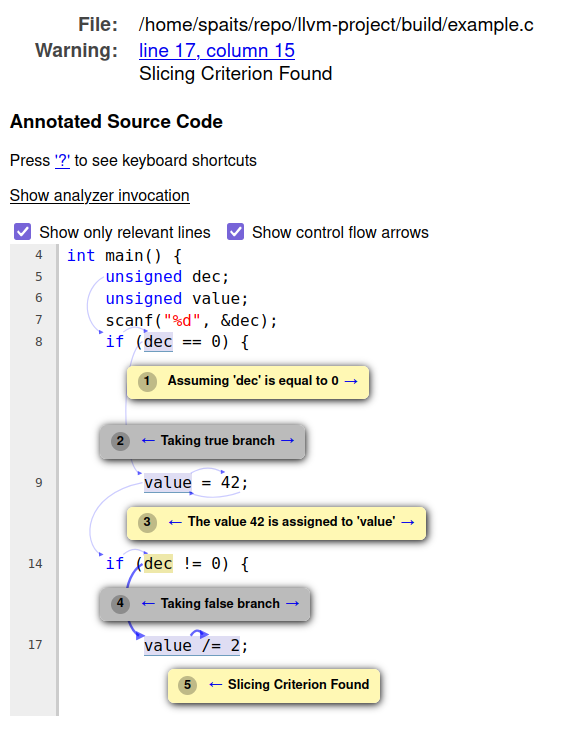

# Clang Symbolic Slicer

Slicing tool based on Clang Static Analyzer.

## Goal of the tool

Most program slicer tools fall into two categories: static or dynamic slicer.
Static slicers only use the source code for analysis while dynamic slicers execute the program.

Both of these approaches have their advantages and drawbacks.
While static slicers examine every single statements, they tend to over estimate slices, since
the miss crucial runtime information, that could used for path feasibility and pointer aliasing. 
On the other hand, dynamic slicers are more precise, due to runtime information, but they tend to 
have poorer coverage, since they can only analyze the statements that were executed.

Symbolic execution is a program slicing technique used to combine the advantages of static and dynamic slicing.
Our prototype uses Clang Static Analyzer's infrastructure to implement slicing with the help of symbolic execution.

## Implementation

The current prototype is based on Clang Static Analyzer's infrastructure (Is rather a part of it for now).
It uses the symbolic execution engine for symbolic execution, a new checker for finding the slicing criterion
and the Bug Reporters for the final data flow analysis and HTML output.

# Usage

The current version heavily builds on Clang Static Analyzer.
To use the tools, the following flags must be specified to `clang`:

`--analyze` : Enable Clang Static Analyzer.
`-Xclang -analyzer-checker=core,alpha.core.SlicingCriterion` : Enable slicer.
`-Xclang -analyzer-output=html` : Produce HTML output. Currently the only available output.
`-Xclang -analyzer-config -Xclang alpha.core.SlicingCriterion:LineNumber=<<Natural Number>>` : The line of the slicing criterion.
`-Xclang -analyzer-config -Xclang alpha.core.SlicingCriterion:ExpressionName=<<String>>`: The name of variable (or any named expression) of the slicing criterion.

# Example

Let's consider the following example code, named `example.c`:
```c
#include <stdio.h>
unsigned getValue();

int main() {
    unsigned dec;
    unsigned value;
    scanf("%d", &dec);
    if (dec == 0) {
        value = 42;
    } else {
        value = getValue();
    }
    
    if (dec != 0) {
        value++;
    } else {
        value /= 2;
    }
    (void)value;
    return 0;
}
```
and take the slicing criterion `(line 17, value)`, (which is `(value /= 2, value)`).

With executing the following command:

```bash
/home/spaits/repo/llvm-project/build/bin/clang --analyze \
    -Xclang -analyzer-checker=core,alpha.core.SlicingCriterion \
    -Xclang -analyzer-output=html \
    -Xclang -analyzer-config -Xclang alpha.core.SlicingCriterion:LineNumber=17 \
    -Xclang -analyzer-config -Xclang alpha.core.SlicingCriterion:ExpressionName=value \
    example.c -o outp
```

We get an HTML file, with a name beginning with the word report, that looks like the following.


